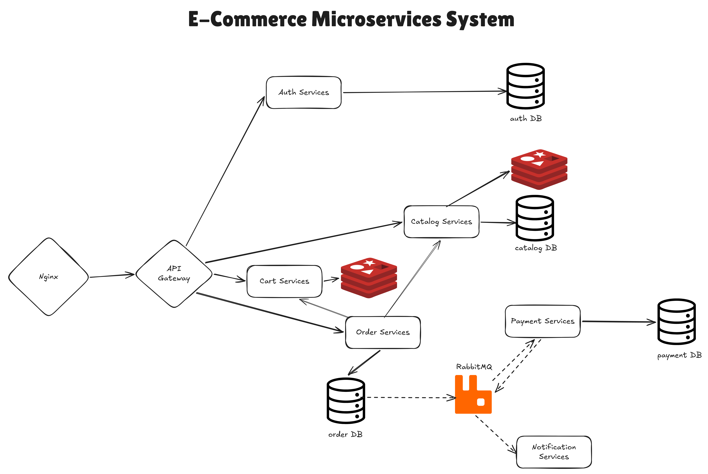

# E-Commerce Microservices System

Пет-проект, реализующий бэкенд e-commerce системы в виде набора независимых микросервисов на **FastAPI**, **PostgreSQL**, **Redis** и **RabbitMQ**. Оформлен как монорепозиторий — вся архитектура, сервисы и инфраструктура доступны в одном месте.

> ⚠️ Статус: **в активной разработке**. Прогресс — в разделе [Roadmap](#roadmap).

## Архитектура



- **Nginx** — reverse proxy, единая точка входа для всего трафика.
- **API Gateway** — маршрутизирует запросы к сервисам, проверяет JWT во входящих запросах.
- **Auth Service** — выдаёт и управляет JWT-токенами; своя Postgres БД.
- **Catalog Service** — каталог товаров; своя Postgres БД + Redis-кэш для часто читаемых данных.
- **Cart Service** — управляет корзинами пользователей; хранится в Redis (эфемерно, с TTL).
- **Order Service** — создаёт и управляет заказами; синхронно обращается к Catalog и Cart, своя Postgres БД, публикует доменные события.
- **Payment Service** — асинхронно обрабатывает платежи через RabbitMQ; своя Postgres БД.
- **Notification Service** — асинхронно отправляет уведомления (email/push) через RabbitMQ.
- **RabbitMQ** — шина событий между Order → Payment → Notification (хореография, без синхронных вызовов после создания заказа).

### Архитектурные решения

- **Своя БД у каждого сервиса** — ни один сервис не читает БД другого напрямую. Доступ к чужим данным — только через API сервиса-владельца.
- **Локальная валидация JWT** — сервисы сами проверяют подпись токена, а не ходят каждый раз в Auth Service, чтобы избежать синхронной зависимости на критичном пути.
- **Transactional outbox pattern** — Order Service пишет заказ и исходящее событие в одну и ту же Postgres-транзакцию (таблица `outbox_events`), после чего фоновый relay-процесс публикует неотправленные события в RabbitMQ. Так решается dual-write проблема между Postgres и RabbitMQ.
- **Хореография вместо оркестрации** — сервисы реагируют на события независимо, без центрального координатора, что снижает связность между сервисами.

## Стек технологий

| Слой | Технология |
|---|---|
| API-фреймворк | FastAPI |
| ORM | SQLAlchemy |
| База данных | PostgreSQL (своя на каждый сервис) |
| Кэш / эфемерное хранилище | Redis |
| Брокер сообщений | RabbitMQ |
| Reverse proxy | Nginx |
| Контейнеризация | Docker, Docker Compose |

## Структура проекта

```
ecommerce-system/
├── services/
│   ├── auth-service/
│   ├── catalog-service/
│   ├── cart-service/
│   ├── order-service/
│   ├── payment-service/
│   └── notification-service/
│       (каждый сервис: app/{api,services,crud,models,schemas,core}, alembic/, Dockerfile)
├── libs/
│   └── shared/
│       ├── events/       # Pydantic-схемы событий RabbitMQ (контракт между сервисами)
│       └── jwt_utils/    # общая логика проверки JWT
├── infra/
│   ├── docker-compose.yml
│   ├── nginx/
│   └── rabbitmq/
├── docs/ 
│   └── architecture.png
└── README.md
```

Каждый сервис самодостаточен (свои зависимости, свой Dockerfile, свои тесты) и внутри устроен по слоям: **router → service → crud** — обработка запроса, бизнес-логика и доступ к данным разделены.

Между сервисами намеренно шарится только два вещи: схемы событий (контракт сообщений) и логика проверки JWT (контракт аутентификации). Всё остальное — модели БД, бизнес-правила — сознательно дублируется в каждом сервисе, а не выносится в общий код, чтобы сохранить независимость деплоя сервисов друг от друга.

## Запуск проекта

```bash
git clone https://github.com/<your-username>/ecommerce-system.git
cd ecommerce-system
docker compose -f infra/docker-compose.yml up --build
```

Поднимутся все сервисы, их базы данных, Redis, RabbitMQ и Nginx.

После запуска документация API каждого сервиса доступна по адресу `http://localhost:<port>/docs` (Swagger UI, генерируется автоматически FastAPI).

## Roadmap

- [ ] Auth Service (выдача JWT, логин/регистрация)
- [ ] Catalog Service (+ Redis-кэш)
- [ ] Cart Service (Redis)
- [ ] Order Service (+ outbox pattern)
- [ ] Payment Service
- [ ] Notification Service
- [ ] Контракты событий RabbitMQ (`libs/shared/events`)
- [ ] Docker Compose для локальной разработки
- [ ] CI (линтер + тесты для каждого сервиса)
- [ ] Валидация JWT в API Gateway


## Автор

Проект разработан AntonNaibayer в качестве учебного, чтобы попрактиковаться в микросервисной архитектуре, событийно-ориентированном дизайне и слоистой структуре приложения на FastAPI.